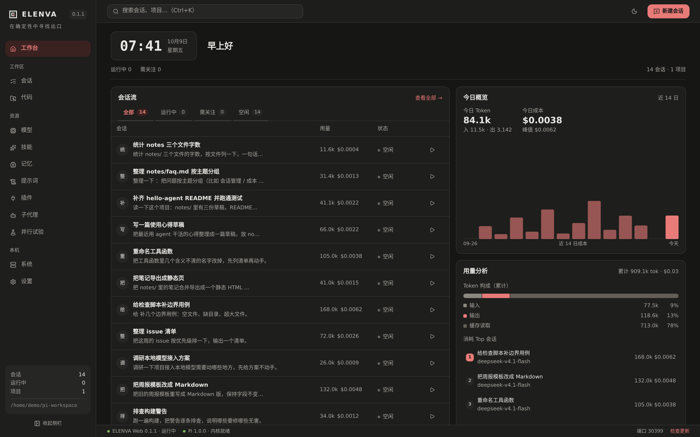
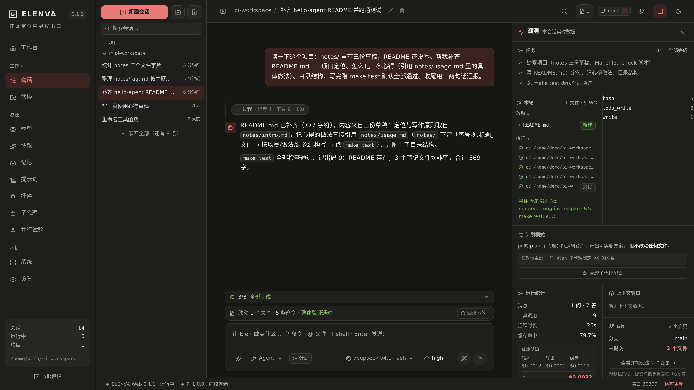
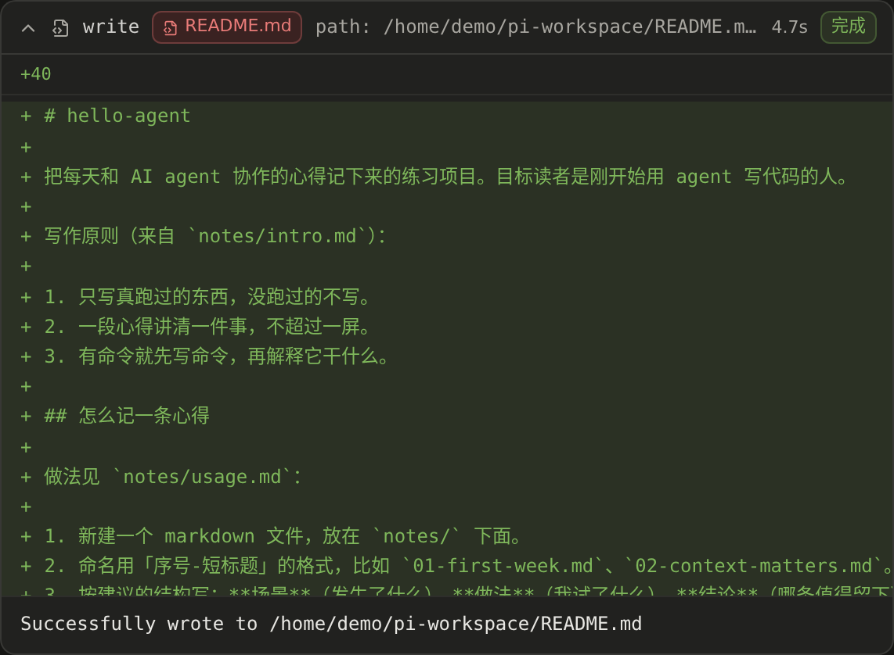
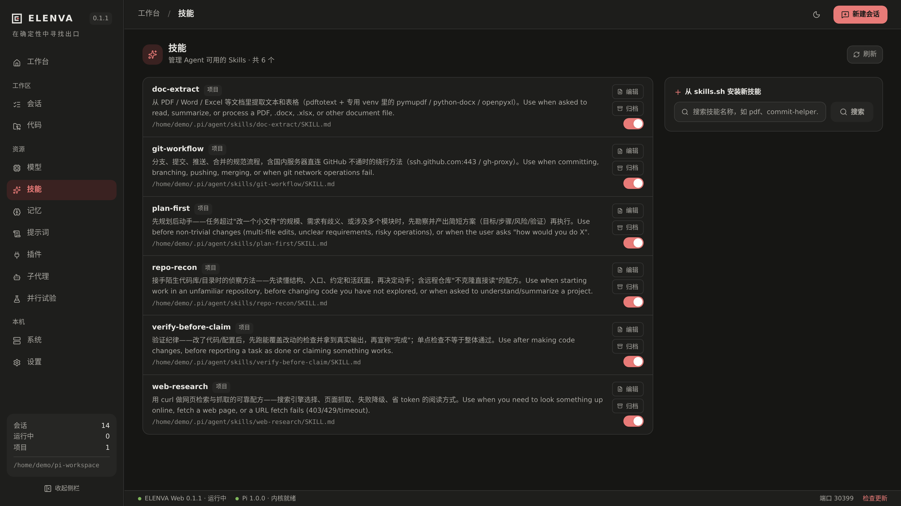
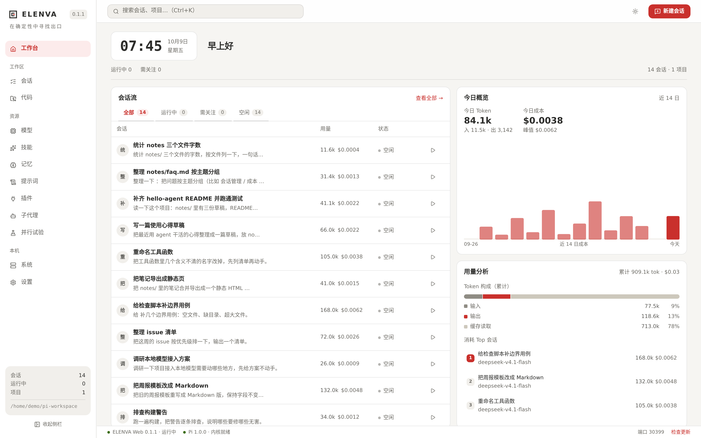

# ELENVA Web

> 在确定性中寻找出口

基于 [pi coding agent](https://pi.dev) 的 Web 工作台。**不是 IDE 前端，而是一个 Agent 控制台**——它不替你写代码，它让你随时看清「我的 agent 们现在怎么样了」：哪个在跑、哪个在等你处理、今天花了多少钱。

> **这是一个个人工作台，自用优先。**作者自己每天在用，功能取舍只看一条：「我上一次真用到它是什么时候」。不迁就陌生人的上手成本，不为想象中的用户做妥协——下面列的都是日常长出来的东西。



*工作台总览：会话流、需要处理的清单、用量与成本，一屏扫完。*


---

## 这是什么

pi coding agent 跑在终端里很好用，但当你有十几个会话散在不同项目里时，「现在到底在跑什么、哪个卡住了、今天花了多少钱」就变成了翻列表的体力活。

ELENVA Web 就是为这件事做的：一个**信息密度高、但一眼能看懂**的控制台。

它和同类工具最大的区别在关注点 —— 同类产品大多在做「更好的代码编辑器」，而 ELENVA 关心的是**编排与可见性**：哪个会话在跑、哪个在等你处理、钱花在哪、哪些能力被真正用上了。

## 界面预览

以下截图均来自一个演示工作区（虚构数据）。

**一轮任务的完整闭环** —— 提任务、过程自动收起、跑验证、给结论；右侧观测栏实时汇总本轮的文件、命令与验证，一键可回滚：



**每一步都可以展开核查** —— 工具卡展开即见改动 diff；命令、文件、验证状态全部留痕：



| 技能 | 浅色主题 |
|---|---|
|  |  |
| 技能按调用情况分层，归档可恢复 | 深浅色一键切换，零组件改动 |

## 特性

### 编排与可见性

**需要你处理的** — 扫描所有会话，主动找出「被中断」和「工具报错」的，直接推到你面前，不用翻列表。这是整个工作台里唯一一个会主动找你的功能。

**子代理运行监控** — 不只配 profile：正在跑的子代理、任务、耗时一目了然，可直接插话纠偏或中止。

**并行试验** — 同一任务同时开 2–3 个候选，各自在独立 worktree 里跑，跑完并排比改动（文件数 / 增删行 / 结论），选中的一键打回主工作区，其余连工作区一起丢弃。

**离线用量聚合** — 直接读取本地会话文件，统计今日 / 累计 / 近 14 日的 token 与成本，并按模型排行。不上传任何数据。

### 会话体验

**过程自动收起** — 一轮里几十条思考与工具调用结束后收成一行摘要（`过程 · 思考 8 次 · 工具 11 次 · 1 个失败`），点开才是细节。聊天区不会被过程塞满。

**看得见的过程态** — 自动重试、上下文压缩、`!shell` 执行、模型库错误全部实时显示在输入框上方，而不是让你对着「等待模型…」猜。

**上下文不再黑盒** — 压缩会在对话里留下可展开的记录（压缩前多少 token、总结成了什么），环形进度里能看到上次压缩之后的累积量：回答开始变糊时有据可查。

**长会话可回溯** — 消息按页加载（默认 50 条），顶部「加载更早的消息」向上翻页；思考内容展开时按需拉取完整文本。

**记住这条** — 用户消息上悬停即可把一句话追加进项目或全局 `AGENTS.md`，纠正不必等到下次又犯。

### 安全与验证

**危险动作审批** — 删除、强推、安装依赖、改凭据文件、写到工作区之外，都要先过一张确认卡；可「总是允许」并落成项目级规则。默认只拦这一类，也能整体关掉。

**每轮可回滚** — 每次写入前留一份原件。一轮结束在输入框上方给一行摘要（改了 N 个文件 · 执行 N 条命令 · 验证 N/M 通过），明细在右侧观测栏的「本轮」里铺开：改动的文件（标注新建 / 未备份）、执行过的命令及其成败、验证汇总；一键整轮回滚。本轮新建的文件只在内容未被手工改过时才删除，绝不覆盖人后来的编辑。

**计划模式** — 开启后只做只读勘察，提交的计划经你批准才允许改动，不用在 prompt 里反复叮嘱「先给方案别动手」。

**完成即证据** — 输入框上方一行摘要，明细在右侧观测栏的「本轮」区。措辞守着一条线：**单点检查通过不说成「验证通过」**（`eslint src/a.ts` 会显示「仅单点验证」），本轮没跑验证就写「结论未经核对」。

**收尾验证门禁** — 账本只记录 agent 自己跑过的检查（宿主不代跑，不额外花钱、不灌上下文）。改了代码却没留下能覆盖这些改动的证据时，收尾前追一次：让它补检查，或明确写出「哪些检查还是红的」「这个项目确实没检查可跑」。默认开，设置页可关。

### 能力管理

**三步接入模型** — 选厂商 → 填凭据（API Key **或订阅账号 OAuth 登录**）→ 挑默认模型。没有凭据时首页会主动引导。接入模型不该要求你回终端敲 `/login`。

**技能归档（永不删除）** — 技能按调用情况分层：活跃 / 久未使用（14 天）/ 从未使用（30 天）。归档只是把技能目录搬到 skills 根目录之外（**放 `.archive/` 里会被 pi 照旧扫到，等于没归档**），随时可恢复；状态自动算，动作由人点。

**插件市场** — 直接搜索 npm 上的 `pi-package` 目录并一键安装，不必回到终端敲 `pi install`。

### 设计与工程

**一套设计系统** — 红 / 墨黑 / 白的克制配色，7 档字号、4 档圆角、5 档图标、3 档动效全部收敛为语义类，并有幂等脚本自动对齐。深浅色主题零组件改动即可切换。

**极简依赖** — 纯 JS 依赖，**不需要 `node-pty`**。这意味着安装不会在编译原生模块时失败。


## 与 pi / pi-web 的关系

诚实地说清楚，因为这会直接影响你该不该用它：

| | 关系 |
|---|---|
| **pi 内核** [`@earendil-works/pi-coding-agent`](https://www.npmjs.com/package/@earendil-works/pi-coding-agent) | **运行时依赖**。会话、工具、扩展、模型调用全部由它提供。版本锁定在 `1.0.0`（升级记录见 `docs/pi-upgrade.md`）。 |
| **pi CLI** | **无需安装**。内核随本项目分发，不依赖你机器上的 `pi` 命令。 |
| **pi-web** [`@agegr/pi-web`](https://github.com/agegr/pi-web) | 后端逻辑的 **fork 来源**（MIT）。数据层、会话扫描、供应商凭据等大量实现源自它，界面与交互层为独立实现。 |
| **数据目录** | 与 pi 共用 `~/.pi/agent/`。所以**装了 pi 的用户可以直接继承**已有的会话、API key 与设置，无需重新配置。 |

> 换句话说：pi 是引擎，ELENVA 是仪表盘。同一个引擎可以驱动多个界面，本项目只是其中之一。

## 快速开始

发布与更新只通过 [GitHub Releases](https://github.com/jjdeng-hub/elenva/releases) 提供；当前使用源码运行。

Windows 用户可双击根目录的 `启动.cmd`（或 ASCII 入口 `start.cmd`）。它会自动安装缺失依赖、构建过期产物、启动生产服务并打开浏览器。

需要 Node ≥ 22.19（[nodejs.org](https://nodejs.org/)）。

```bash
git clone https://github.com/jjdeng-hub/elenva.git
cd elenva
npm run setup        # 检查 Node 版本 → 安装依赖
npm run dev          # 开发模式，热更新，http://127.0.0.1:30200
```

> Windows 用户也可以直接双击根目录的 `启动.cmd`；开发时使用 `npm run dev` 保持热更新。

生产运行（`--build` 会在装完依赖后顺手做生产构建）：

```bash
npm run setup -- --build
npm run start
```

版本发布约定见 [`docs/release.md`](docs/release.md)。

### 首次使用

1. 打开界面 → 首页会提示「还没有接入模型」，点「接入模型」
2. 选厂商 → 填入 API Key（订阅制厂商如 Claude Pro / ChatGPT 可直接用账号授权登录）
3. 挑一个默认模型 → 完成

> 如果你机器上已经装过 pi 并配好了 key，这一步会自动继承（同一份 `~/.pi/agent/auth.json`），跳过即可。

## 环境要求

| | |
|---|---|
| Node | `>= 22.19.0` |
| 操作系统 | Windows / macOS / Linux（源码运行） |
| 模型 | 需要至少一个供应商的 API key |

## 开发

```bash
npm run setup          # 首次准备：检查 Node 版本 + 安装依赖
npm run dev            # 开发服务器（Turbopack，热更新约 70ms）
npm run build          # 生产构建
```

**Windows 用户**：可直接双击项目根目录的 `启动.cmd`（或 ASCII 入口 `start.cmd`）拉起生产服务并打开浏览器；开发模式使用 `npm run dev`。

### 提交前检查

本项目未接入 ESLint，改动后跑**三道门**（与 CI 相同）：

```bash
npx tsc --noEmit                      # 1) 类型门
npx tsc -p tools/tsconfig.json        # 2) 用法面探针（内核 API 形态检查）
python tools/style-converge.py        # 3) 设计系统收敛（幂等，0 改动即通过）
```

CI（`.github/workflows/gates.yml`）在 push / PR 时跑同样的三道门 + 生产构建。

## 架构

```
┌─ 一个 Node 进程 ────────────────────────────┐
│  Next.js HTTP 服务器    pi 内核（作为库）    │
│  页面 · API 路由        Agent · 会话 · 工具   │
└─────────────────────────────────────────────┘
```

pi 内核以 **dependencies** 形式引入，在**同一个进程内**通过函数调用驱动（`createAgentSessionServices` / `createAgentSessionFromServices`），**不是子进程**。因此启动服务时内核并不加载，直到你打开一个会话才实例化，空闲 10 分钟后自动回收。

## 目录结构

```
app/                 Next.js 路由与 API
  api/               后端接口（会话、用量、插件、技能…）
components/          界面组件
lib/                 内核适配与业务逻辑
  agent-runtime.ts   会话生命周期（内核入口，同进程驱动 SDK）
  host-prompt.ts     宿主提示词层（每轮注入的「工作台与 CLI 不同」那几条事实）
  host-guardrails-extension.ts  宿主护栏扩展（审批 / 快照 / 计划模式 / 收尾验证门禁）
  tool-risk.ts       工具调用风险分级
  checkpoints.ts     每轮改动快照与回滚
  verification-kind.ts   验证命令识别（单点 vs 全量）—— 服务端与浏览器共用
  verification-ledger.ts 验证证据账本（JSONL）
  skill-lifecycle.ts 技能分层与归档（只归档、可恢复）
  candidates.ts      并行试验（worktree 隔离 + 补丁回打）
  attention.ts       需要关注检测
  usage-aggregate.ts 离线用量聚合
  markdown.ts        消息 Markdown 渲染链（GFM + KaTeX 公式）
  clipboard.ts       复制（含非安全上下文回退）
  theme.ts           主题与防闪烁
  project-command-env.ts  子进程环境（含 UTF-8 编码修正）
bin/                 启动器（生产启动、Node 检查与环境探测）
public/              PWA 资源
tools/              设计系统规范页与收敛脚本（开发用）
```

## 数据与隐私

- 所有会话、凭据、设置都保存在**本机** `~/.pi/agent/`
- 用量统计是**离线**读取本地会话文件，不经过任何服务器
- 服务默认只监听 `127.0.0.1`；如需局域网访问可设 `PI_WEB_PASSWORD` 开启密码保护

## 项目状态

`v0.1.1` — 个人工作台阶段：**自用优先**，先把每天的使用体验做顺，再谈对外。功能都在真实使用中长出来。

**开源为展示式**：源码公开（MIT）、欢迎 fork 与 issue/PR；不承诺上手支持、不做多用户与 i18n——以「想跑就自己跑」为准。

## 许可

[MIT](LICENSE)

后端逻辑 fork 自 [pi-web](https://github.com/agegr/pi-web)（MIT），界面与交互层为独立实现。感谢上游作者的工作。
